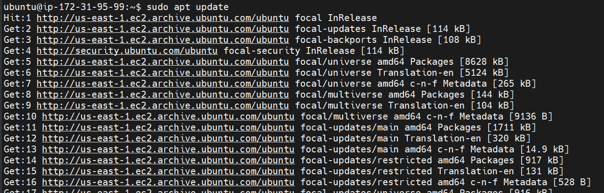

# CONTINOUS INTERGRATION PIPELINE FOR TOOLING WEBSITE

Create an Ubuntu instance with tcp port 8080 open

Update Ubuntu

`sudo apt update`

Install JDK

`sudo apt install default-jdk-headless`

Install Jenkins

`wget -q -O - https://pkg.jenkins.io/debian-stable/jenkins.io.key | sudo apt-key add -`

`sudo sh -c 'echo deb https://pkg.jenkins.io/debian-stable binary/ > \ /etc/apt/sources.list.d/jenkins.list'`

`sudo apt update`

`sudo apt-get install jenkins`

Verify Jenkins is running 

`sudo systemctl status jenkins`

Setup Jenkins via web using port 8080

Get administrator password from local server

`sudo cat /var/lib/jenkins/secrets/initialAdminPassword`

Configure Jenkins to retrieve source codes from GitHub

Build job

Configure Jenkins to retrieve source codes from GitHub using Webhooks

Add build trigger by selecting "github hook trigger for GITSCM poling"

Add post-build Actions by selecting "archicve the artifacts" set ** as files to archive 

Build job by commiting changes to github repository 

Artifacts are stored on Jenkins server locally

`ls /var/lib/jenkins/jobs/tooling_github/builds/<build_number>/archive/` 

## Configure Jenkins to copy files to NFS server via SSH

Install "Publish Over SSH" plugin

Configure the job to copy artifacts over to NFS server by adding pem key of instance

Configure Job post-build Actions by selecting "send build artifacts over SSH"

Build job by commiting changes to github repository 

Verify files were updated in local server 

`cat /mnt/apps/README.md`

